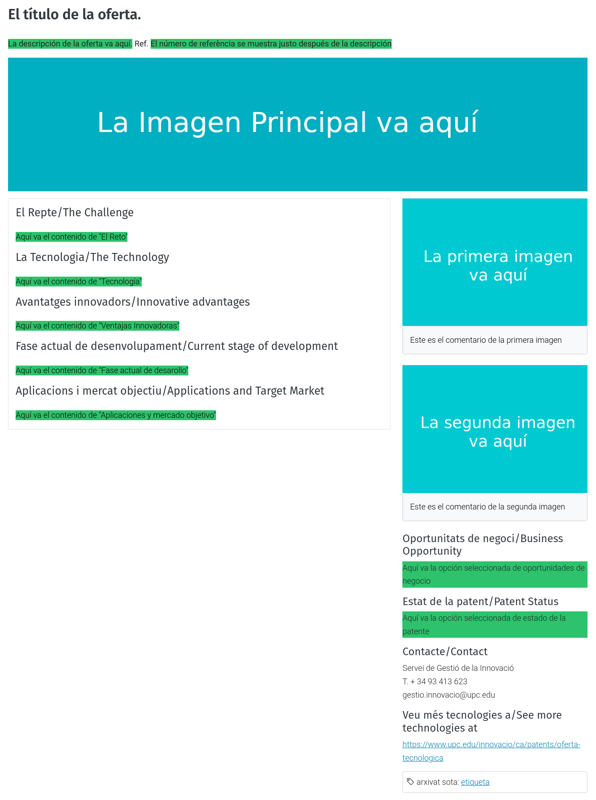
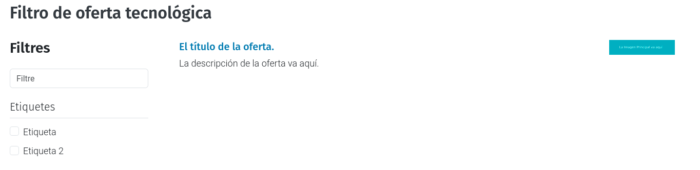

.. This README is meant for consumption by humans and PyPI. PyPI can render rst files so please do not use Sphinx features.
   If you want to learn more about writing documentation, please check out: http://docs.plone.org/about/documentation_styleguide.html
   This text does not appear on PyPI or github. It is a comment.

.. image:: https://github.com/upcnet/genweb6.patents/actions/workflows/ci.yml/badge.svg
    :target: https://github.com/upcnet/genweb6.patents/actions/workflows/ci.yml

###############
genweb6.patents
###############

Paquete de Genweb6 para gestionar la oferta tecnológica

- python 3.11
- Plone 6.0 classic

Instalación
===========

Instala el paquete ``genweb6.patents`` añadiéndolo en los eggs 
de la sección ``plone.recipe.zope2instance``::

    [instance]
    recipe = plone.recipe.zope2instance
    eggs =
        Plone
        …
        genweb6.patents

Para instalarlo en modo desarollo, hay que además añadirlo a ``sources`` 
y especificar la configuración en la sección ``buildout``::
  
    [buildout]
        …
        develop = 
        developeggs +=
            …
            genweb6.patents

        extensions = mr.developer
        always-checkout = false
        auto-checkout = ${buildout:developeggs}
        …

    [sources]
        genweb6.patents = git https://github.com/UPCnet/genweb6.patents.git branch=master

Finalmente hacer el buildout del paquete ``bin/buildout`` o boostrap ``bash bootsrap.sh``

Una vez instalado el paquete en la página de Plone es recomendable llamar la vista ``/configure_techoffer`` 
en la ruta de la página. (La vista está explicada más abajo)

Documentación
=============
Tipo de contenido: Oferta Tecnológica
-------------------------------------
Este nuevo tipo de contenido solo se puede añadir en las caretas.
Se construye a partir de los siguientes campos:

- ``Título``: el título de la oferta tecnológica.
- ``Descripción [opcional]``: la descripción de la oferta tecnológica.
- ``Número de referencia``: el número de referencia de la patente.
- ``El Reto``: una breve explicación del problema que se quiere resolver.
- ``Tecnología``: una breve explicación de la tecnología involucrada en la solución del reto.
- ``Ventajas innovadoras``: una breve explicación de las ventajas que puede aportar la solución.
- ``Fase actual del desarrollo``: una breve explicación del estado actual del desarrollo de la solución
- ``Aplicaciones i mercado objetivo``: una breve explicación del mercado objetivo  
- ``Imagen principal [opcional]``: La imagen principal de la oferta, sale en el listado de las patentes.
- ``Primera imagen [opcional]``: Una imagen relevante para la oferta 
    - Es recomendable usar una imagen de dimensiones con una relación similar a 13x3 (por ejemplo 1300*300)
- ``Comentario de la primera imagen [opcional]``: Un comentario que saldrá justo debajo de la primera imagen
- ``Segunda imagen [opcional]``: Una segunda imagen que mostrará después de la primera 
- ``Comentario de la segunda imagen [opcional]``: Un comentario que saldrá justo debajo de la primera imagen
- ``Oportunidades de negocio``: A seleccionar entre las siguientes opciones:
    -  Tecnología disponible a ser licenciada
    -  Tecnología disponible para ser licenciada con cooperación técnica
    -  Otros
- ``Especificar oportunidades de negocio``: Otra opción para oportunidades de negocio. 
    - Si en el campo anterior, "Oportunidades de negocio", se ha escogido "Otros",este campo es obligatorio para rellenar. 
    - En cualquier otro caso se ignora. 
- ``Estado de la patente``: A seleccionar entre las siguientes opciones:
    -  No posibilidad de patente
    -  Pendiente de protección
    -  Patente solicitada
    -  PCT solicitada
    -  Patente aprobada
    -  Patente denegada
    -  Otras formas de protección
    -  Secreto industrial

En la siguiente imagen se muestra cómo se visualiza el contenido. **Nota**: los estilos de los valores han 
sido exagerados para que contraste con el contenido estático, para así visualizar mejor la distribución de los campos
en la página.

Vista: Filtro de las ofertas tecnológicas (/techoffer_filter)
-------------------------------------------------------------
Muestra un listado de todas las ofertas tecnológicas.
Proporciona también un campo de búsqueda y un filtro por etiquetas.

- El campo de búsqueda busca palabras en todo el contenido (título, descripción, reto, tecnología, etc...)
- Las ofertas que se filtran han de tener TODAS las etiquetas seleccionadas
  

Vista: Configuración de oferta tecnológica (/configure_techoffer)
-----------------------------------------------------------------
Crea la estructura de patentes en la página.

Parámetros:
- ``recreate_subjects`` [bool]: Si se activa, se recrean las etiquetas de las ofertas tecnológicas.

Funconamiento:
- Se crea la carpeta ``patents``
- Se crea la carpeta ``patents/ofreta-tecnologica``
    - Si ``recreate_subjects`` está activado, se crean recrean las etiquetas ofertas tecnológicas (se pierden las que ya existen)
- Se crea el formulario ``patents/oferta-tecnologica/create-tecnological-offer``
    - Este formulario replica los campos del tipo de contenido "Oferta Tecnológica"
      y, al enviar, crea una nueva oferta dentro de la carpeta ``patents/ofreta-tecnologica``
- Se crea la colección ``patents/ofreta-tecnologica/technological-offers-to-review``
    - Esta colección recopila todas las ofertas en estado "Borrador"
   